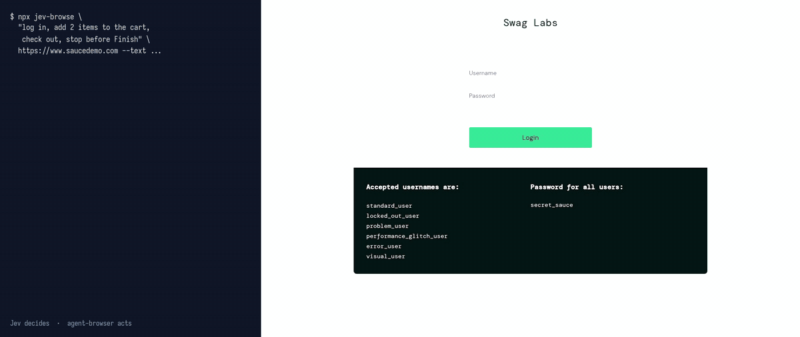

# jev-browse

jev-browse drives a real browser with [TypeSafe Jev](https://docs.typesafe.ai/introduction) making every decision and [agent-browser](https://github.com/vercel-labs/agent-browser) performing every action. You give it a goal, such as `open the Hacker News FAQ`. Jev picks each click, chooses which of your texts to type into which box, and decides when the goal is reached or can't be reached.

jev-browse is an unofficial project and isn't affiliated with TypeSafe or Vercel.



## Benchmark

The following table compares jev-browse with Claude Code driving agent-browser directly on the same 10 tasks, 3 runs each. Claude Code ran on 16 September 2026, and jev-browse ran on 17 September 2026 with its default network wait. Both agents had the same limits: agent-browser commands only, no entering URLs, and only the texts given for the task. Every run started with cleared cookies and site storage.

| Agent | Passed | Median time per task | Cost per task |
| --- | --- | --- | --- |
| jev-browse (Jev + agent-browser) | 30/30 | 4.4 s | $0.0009 |
| Claude Code (Claude Sonnet 5) + agent-browser | 30/30 | 9.4 s | $0.0679 |

The tasks include navigation goals on Wikipedia, Hacker News, example.com, and the TypeSafe docs, 2 goals that need typing, and 2 goals that the agent must refuse, such as logging in without credentials. The longest task runs a checkout on the [Sauce Labs demo shop](https://www.saucedemo.com): log in, add 2 items to the cart, fill in the checkout form, and stop before **Finish**. jev-browse finished it in 23.3 to 23.5 s for $0.0010. Claude Code took 19.8 to 29.3 s for about $0.08.

The results show that jev-browse has a lower median time and costs about 70 times less on these tasks. On the checkout task, the default network wait makes jev-browse about as fast as Claude Code. They don't show how it performs on longer or more complex tasks.

Jev cost is the input tokens at $0.042 per million tokens. Claude Code cost is the `total_cost_usd` value that Claude Code reports at API list prices. To rerun the benchmark, see [Run the benchmark](#run-the-benchmark).

## How it works

Each step sends one request to Jev, which answers 3 kinds of questions at once:

- Is the current page the goal?
- Does the goal need an action that the agent can't do?
- Which action makes the most progress: a click, typing one of your texts, pressing Enter, or going back?

Jev answers with probabilities and never writes text. Any search query or form value comes from you, or from the AI agent that calls the MCP server.

## Limits

jev-browse has these limits:

- It types only the texts that you pass. It can't write its own text or enter URLs.
- It logs in only with a username and password that you pass as texts. It can't create accounts, solve CAPTCHAs, hover, drag, upload files, or download files.
- When several elements on a page have the same label, such as a row of **Add to cart** buttons, it sees only the first one.
- It doesn't write answers or summaries. A run succeeds when it ends on the page that the goal names. With `--extract`, it returns matching page lines verbatim, and it can miss some of them.
- It sends the page content and your texts, including any password, to TypeSafe with every request. Pass only test or throwaway credentials.

## Requirements

You need the following:

- Node.js 22.9 or later.
- [agent-browser](https://github.com/vercel-labs/agent-browser), installed so that `agent-browser --version` works.
- A TypeSafe API key in the `TYPESAFE_API_KEY` environment variable.

## Use the command-line tool

To reach a page, run the following command:

```bash
npx github:kyrylosyzonenko/jev-browse "open the Hacker News FAQ" https://news.ycombinator.com
```

To let the agent type, pass each text with `--text NAME=VALUE`:

```bash
npx github:kyrylosyzonenko/jev-browse "open the Wikipedia article about Kermit the Frog" https://en.wikipedia.org/wiki/Rubber_duck --text "query=Kermit the Frog"
```

The command-line tool has these options:

| Option | Default | Description |
| --- | --- | --- |
| `--text NAME=VALUE` | None | A text that the agent may type. Repeat the option for more texts. |
| `--steps N` | `15` | The maximum number of steps. |
| `--done P` | `0.8` | The probability at which a run stops as reached or blocked. |
| `--extract WHAT` | None | Describes the data to return from the final page, such as `hotels, each with its price`. When the goal is reached, Jev selects the page lines that match, and the command prints them verbatim after `extracted`. |
| `--no-network-wait` | Off | Skips waiting for network activity to end after every action. Runs are faster, but sites that reload in the background, such as Google Hotels, can reset typed values. |

The command exits with one of these codes:

| Code | Meaning |
| --- | --- |
| `0` | The goal was reached. |
| `1` | The agent found no useful action or hit the step limit. |
| `2` | The command was used incorrectly. |
| `3` | The goal needs an action that the agent can't do. |
| `4` | The run crashed, for example because the API key is missing. |

## Use the MCP server

The MCP server exposes one tool, `browse`. The tool takes a `goal`, an optional `url`, optional `texts` such as `{"query": "Kermit the Frog"}`, an optional `steps` limit, an optional `extract` description of the data to return, and an optional `networkWait` switch that is `true` by default. It returns a status of `reached`, `stopped`, `blocked`, or `error`, the final URL, the step log, and any extracted lines. The browser stays open afterward, so the calling agent can read the final page with agent-browser.

To add the server to Claude Code, run the following command:

```bash
claude mcp add jev-browse -e TYPESAFE_API_KEY=YOUR_API_KEY -- npx -y -p github:kyrylosyzonenko/jev-browse jev-browse-mcp
```

To add the server to Codex, run the following command:

```bash
codex mcp add jev-browse --env TYPESAFE_API_KEY=YOUR_API_KEY -- npx -y -p github:kyrylosyzonenko/jev-browse jev-browse-mcp
```

To add the server to Hermes Agent, run the following command:

```bash
hermes mcp add jev-browse --command npx --env TYPESAFE_API_KEY=YOUR_API_KEY --args -y -p github:kyrylosyzonenko/jev-browse jev-browse-mcp
```

Any other MCP client that runs stdio servers can use the same `npx` command.

## Run the benchmark

To run the benchmark from a clone, follow these steps:

1. Clone the repository and install the dependencies:

   ```bash
   git clone https://github.com/kyrylosyzonenko/jev-browse.git && cd jev-browse && npm install
   ```

1. Copy `.env.example` to `.env`, and put your TypeSafe API key in it.
1. Run every task 3 times with both agents:

   ```bash
   node --env-file-if-exists=.env eval.mjs 3
   ```

The Claude Code runs need the `claude` command and cost real money, up to $2 per run. To change the Claude model, add `--model opus`. To run only one agent, add `--only jev` or `--only claude`.

## Support me

I build jev-browse in my own time, and it's free to use. If you want to support me, you can send a tip on [Ko-fi](https://ko-fi.com/kyrylo3238).

## License

jev-browse is released under the [MIT License](LICENSE).
